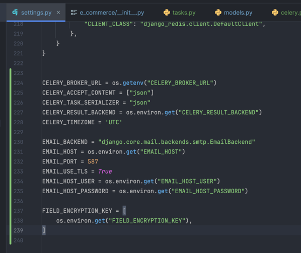
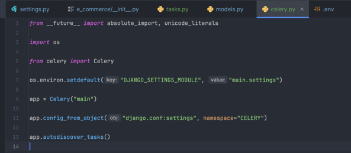
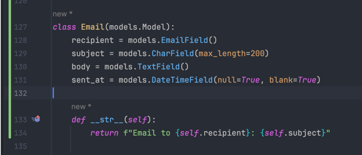
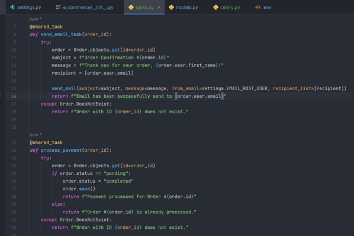
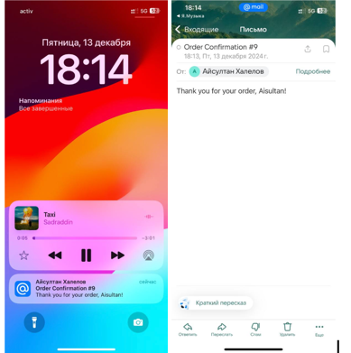
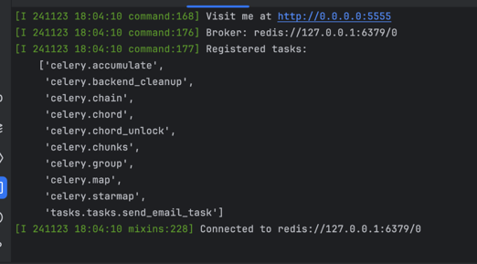
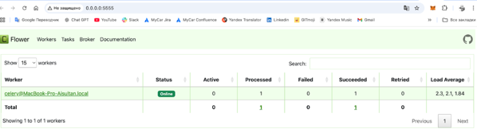

### Message Queues and Asynchronous Processing

I chose **Redis** as the message broker for the project. To set it up, I first installed Redis using brew and then started it with command: `brew services start redis`

This ensures that Redis is running on my computer. After installing Redis, I updated the **Celery** configuration in the settings.py of my Django project to use Redis as the broker. The configuration was as follows:

This configuration allows Celery to connect to Redis and use it to queue and process tasks.

I defined a simple model `Email`.

I defined a Celery task inside the orders/tasks.py file to send emails. The task used Django’s built-in send_mail function.

For configuring the email sending process, I have added email backend configurations to settings.py file.

The user receives feedback immediately, and the actual email sending happens in the background via Celery. Here are the screens that prove that services work properly.

celery -A main flower:

I installed Celery Flower for task monitoring: pip install flower

I access via http://localhost:5555 to monitor the status of tasks being processed. Flower provided a real-time web interface that allowed me to see the tasks being processed, check their status, and debug any issues with the tasks. Here in the screenshot we see that 1 task was processed and succeeded. (Previous example that I provided).

I implemented retry logic in the send_email_task to handle failure scenarios, such as connection issues with the email server. By following these steps, I successfully implemented an asynchronous email-sending system using Celery and Redis in a Django application.
