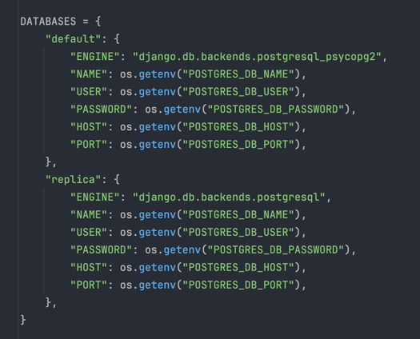

# Distributed Systems and Data Consistency

To achieve scalability and ensure data consistency in my project, I decided to implement database replication. Replication involves running a cluster of PostgreSQL database instances: a leader (also called a "primary") database and multiple replicas. By configuring Django to query replicas for read operations and the primary database for write operations, this approach scales performance linearly by adding replicas. In theory, with two replicas, the system achieves 2x performance; with four replicas, 4x performance, and so on.

## Database Replication

### Configuration Overview

The primary database is stored under the default key, while the replica database is stored under the replica key in the Django settings file. Without further configuration, Django would continue to use the default database for all operations. To address this, I created a database router that directs all read queries to the replica database while keeping all write queries directed to the primary database.

I store the primary database under the “default” key and the replica under the “replica” key. If I did nothing else, Django would have no idea what to do with the replica: it wouldn’t use that database and would continue to use the default database for all queries.

To inform Django of the presence of the replica and direct all read queries to it, we need to create a router.

### Verification of Replication

To confirm replication is working, I used the Python Django shell and performed the following steps:
1. Queried one `Category` instance from the database (read process).
2. Created the `Product` (write process).
3. Queried the first product from the database (read process).

In steps 1 and 3, the replica database instance was used because these are read operations, whereas in step 2, the default (primary) database was used because it is a write operation.

## Ensuring Data Consistency

To ensure data consistency in my project, I implemented several functions and configurations:

### 1. Using Transactions in Critical Operations

Transactions ensure that all dependent operations within an atomic block are either executed completely or not executed at all. This prevents partial updates that could lead to data inconsistencies.

If updating the stock or creating an order item fails, the entire operation is rolled back, leaving the database in its original state.

### 2. Consistency with Django Signals

I used Django signals to maintain consistency between related data. For example, after creating an OrderItem, I recalculated the total amount of the associated Order to ensure consistency and handle data invalidation.

This ensures that the `Order` total is automatically updated whenever an OrderItem is created or modified.

### 3. Accurate Serializers for Data Validation

Accurate and detailed serializers help prevent invalid data from being saved in the first place, reducing the likelihood of inconsistencies.

This validation prevents orders from being created if there is insufficient stock, ensuring consistency between `Product` and `OrderItem` data.

__________
Replication allows the system to handle high read traffic effectively, while the additional measures maintain the integrity of the data across operations.
