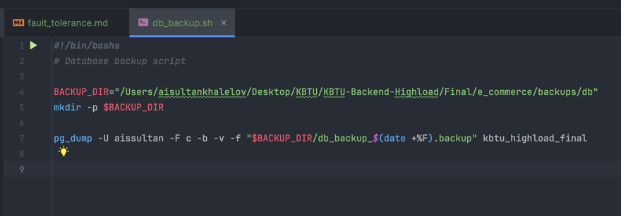
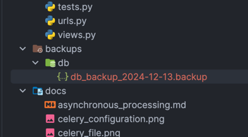

# Fault Tolerance and Resilience

## Overview
High-load systems must be designed with fault tolerance and resilience to ensure uninterrupted service and protection against data loss. This document outlines the strategies implemented in the project, including redundancy for critical components and a disaster recovery plan.

---

## Redundancy in Critical Components

### Database Replication
  - Configured **PostgreSQL replication** with one primary database and one read replica.
  - The primary database handles write operations, while replica handles read operations, distributing the load and ensuring availability during failures.

### Load Balancer
  - Configured **Nginx** as a load balancer to distribute traffic across multiple Gunicorn application instances.
  - If one instance fails, the load balancer redirects traffic to healthy instances.

### Message Broker (Redis)
  - Enabled Redis high availability by clustering Redis nodes.
  - Ensures that message queues remain accessible even if a single node fails.

---

## Disaster Recovery Plan

### Backup Strategies

1. **Database Backups**
   - Scheduled automatic backups of the primary database using **pg_dump**:
     
   - 

   - Automate these scripts using cron jobs:

2. **Static Files Backup**

3. **Configuration Files Backup**
   - Regularly backup critical configuration files such as `nginx.conf`, `settings.py`, and Celery configurations.

4. **Application Monitoring**:
   - Use Grafana dashboards to track API response times, error rates, and server health.

## Conclusion
By implementing database replication, load balancing, and robust backup strategies, the system achieves high availability and fault tolerance. Disaster recovery processes ensure that critical user data and services are restored promptly in the event of failure.

---
