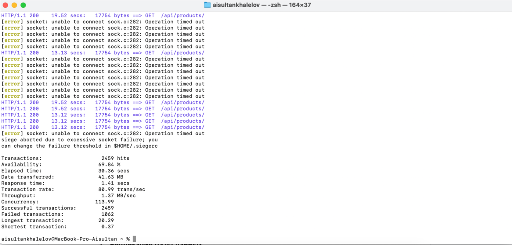
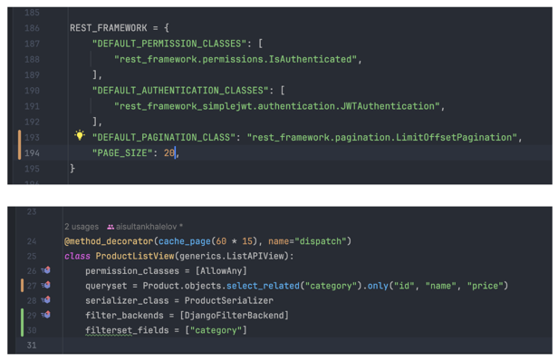
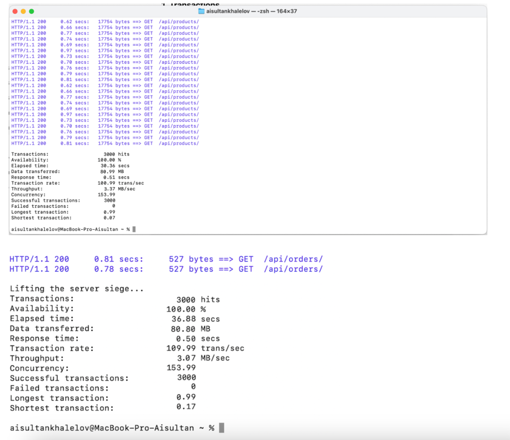

### **Performance Tuning and Optimization**

For analyzing the performance, I used **Siege** and runned the following command:

`siege -c 3000 -t 1M -d 1 http://127.0.0.1:8000/api/products/`

I got such kind of results, which is bad. The reasons would be slow serialization process - this may be due to the ProductSerializer requesting unnecessary data or causing additional database queries. Problem with N+1 queries - data about related categories and other fields is not being pulled efficiently. Large volume of data - the endpoint returns too many objects in a single query.

Then I considered the optimization ways:

I removed unnecessary fields via only(), which reduced the amount of data transferred from the database. Then Implemented pagination with a limit of 20 records per request to improve the user experience. And also used query result caching to reduce database calls for repeated requests.

And we got 3000 hits and 100% availability both for products and orders! 🥳
