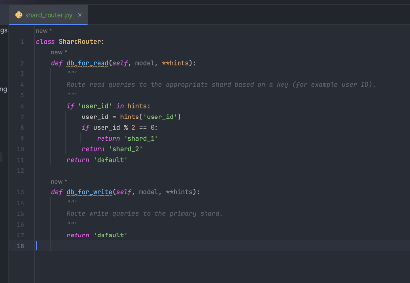
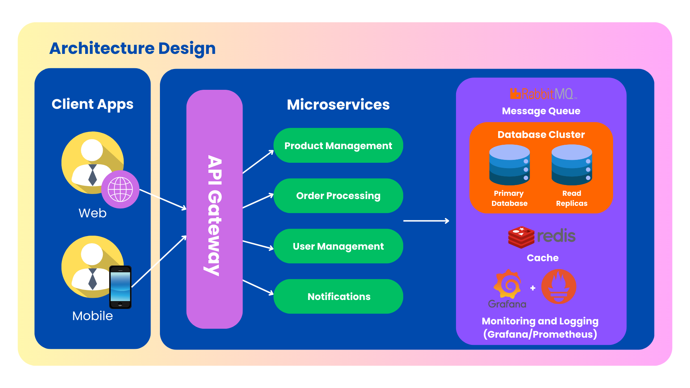

# Scaling Backend Systems

## Opportunities for Scaling

To ensure that the system can handle increasing traffic and maintain performance, I identified two key approaches for scaling the backend:

### 1. **Database Sharding**
Sharding involves splitting the database into smaller, faster, and more manageable parts called shards. Each shard is an independent database that contains a subset of the data. Sharding is especially useful for large-scale applications where a single database can become a bottleneck.

#### Benefits:
- Improved query performance by reducing the size of each shard.
- Enables horizontal scaling by distributing shards across multiple servers.
- Isolation of data by key, such as user ID or product category.

#### Implementation Plan:
- Partition data by a specific key, such as user ID or order ID.
- Update the application’s database routing logic to direct queries to the appropriate shard.
- Use Django database routers to implement sharding logic.

### 2. **Transition to Microservices**

Microservices involve breaking the monolithic application into smaller, independently deployable services. This approach is beneficial for large systems as it improves scalability, fault tolerance, and deployment flexibility.

Key Microservices that we can implement:

1. **Product Management Microservice**
   - Handles CRUD operations for products and categories.
   - Optimized for frequent updates and queries by administrators.

2. **Order Processing Microservice**
   - Manages order creation, updates, and payments.
   - Processes high volumes of concurrent orders with queue-based processing.

3. **User Management Microservice**
   - Manages user authentication, profile updates, and authorization.

4. **Notifications**
   - Processes notifications.

#### Architecture Diagram:

**Database Layer**:

Microservices write to the `primary database` and read from `replicas`.
Notifications Microservice reads from the database to fetch user contact details.

**Message Queue:**

Notifications are triggered through `RabbitMQ`.
Order and User Management Microservices send messages (e.g., new order placed, password reset).

**Cache Layer:**

Frequently queried data (e.g., product listings) is cached in `Redis`.

**Monitoring and Logs:**

Metrics from all components are sent to `Prometheus` and `Grafana`.
