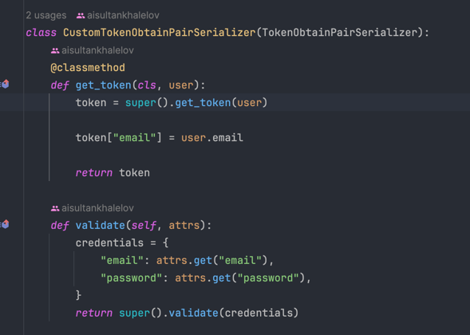
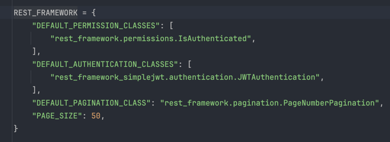
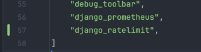
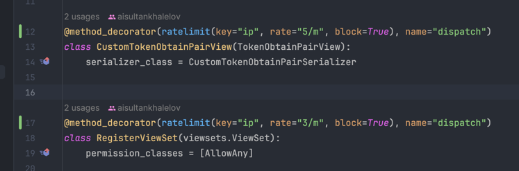
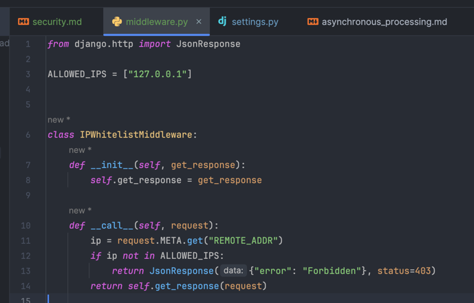
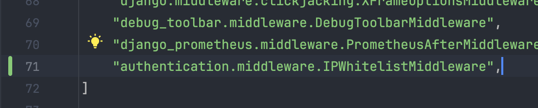
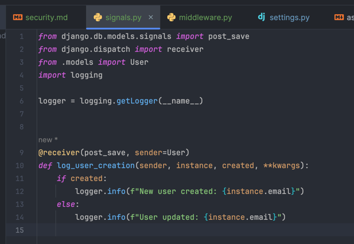

### Security in High-Load Systems

To ensure secure handling of user authentication and registration endpoints, I conducted a security audit and implemented multiple security measures in the project. These changes ensure protection against common vulnerabilities and adhere to best practices for high-load systems.

1. **Enhanced JWT Authentication:**
   - Customized CustomTokenObtainPairView to include additional claims (e.g., user email) in the JWT.
   - Added email-based validation for user authentication.
    - 
2. **Permission Management:**
   - Configured granular permissions:
     - AllowAny for registration endpoints, getting products and categories.
     - IsAuthenticated for user actions such as updating or deleting accounts, order creating, shopping cart and wishlist management.
     - 
3. **Audit Logging**:
   - Used Django signals to log user creation and updates for monitoring and security purposes.
4. **Rate Limiting**
   - Integrated django-ratelimit middleware to prevent brute-force attacks on login and registration endpoints.
   - 
   - 
5. **Middleware for IP Whitelisting**
   - Implemented middleware to restrict access to authentication endpoints from specific IP ranges.
   - 
   - 
6. **Audit Logging:**
   - Used Django signals to log user creation and updates for monitoring and security purposes.
   - 

These measures significantly enhance the security of high-load systems, ensuring safe handling of sensitive user data.
